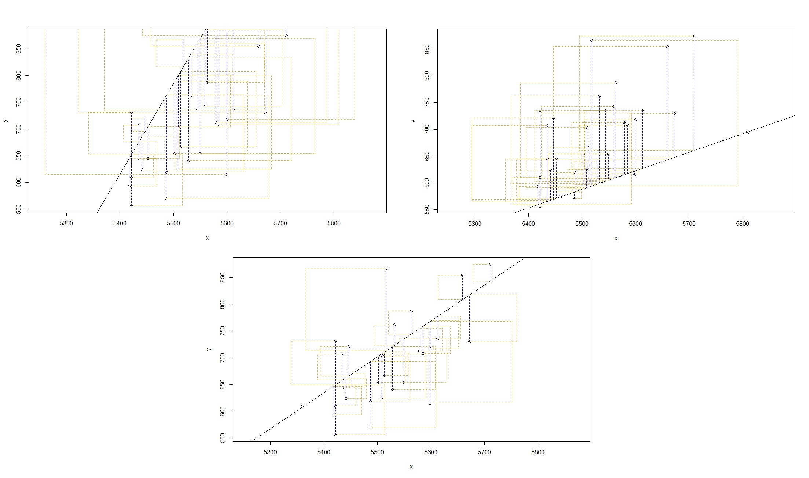

# Part 2 - Sum of Squared Residuals 

<br>

Think back to the way that we described the distribution of a single variable in S1Y Lab 1. Recall that we discussed characteristics such as center, spread, and shape. 

Just as you've used the mean, standard deviation and other statistics to summarize a single variable,  you can summarize the relationship between two variables by **finding the line that best follows their association**. 

To do this rigorously, we use something called **residuals**. 

Residuals are the difference between the observed values, (the values in the actual dataset), and the values predicted by the line/(eventually the model). Namely,

$$\textrm{Residual} = \textrm{Observed Value} - \textrm{Value Fitted by the Line}$$

$$e_i = y_i - \hat{y_i}$$
Look at the graphs below. These show different lines, (with different gradients and intercepts), to give you an idea for what what we mean when we talk about the residual sum of squares. 

* **Black Line:** The chosen regression line, that attempts to best fit the association between the two variables; in this case we still have Runs against At-Bats. 

* **Points:** The observed values from the dataset 

* **Blue Line:** Represents the residual of each point. Remember that the residual $e_i = y_i - \hat{y_i}$, so the blue line represents the difference between the observed value, the point, and the fitted value, the place at which the point meets the line going straight up/down towards it. 

* **Orange Squares:** This represents the square of each residual. As in literally the area of each orange circle $= e_i^2$.

```{r graphtrio, echo = FALSE, out.width = "100%", fig.cap = ""}

```

The most common way to do linear regression is to select the line that minimizes the sum of squared residuals. Literally the line that creates the smallest total area when you add up the area of all of the orange squares. 

You can see in the figure that some lines will be better than others, and you could probably give a reasonable guess by eye, like you did at some point in school. 

The process of minimising the sum of the squares of the residuals is just a way of mathematically/statistically formalising the procedure of eyeballing the best fitting line. 

<br>

**What happens to the residuals when the line doesn't fit the points very well?**

```{r, echo = FALSE}
q_name <- sample(c(
    "Too many of the points will be too far from the line, hence the residuals will be too small In turn, the residual sum of squares, (the total area of all the orange squares), will be too small.",
    "Too many of the points will be too far from the line, hence the residuals will be small. In turn, the residual sum of squares, (the total area of all the orange squares), will be too large.",
    answer = "Too many of the points will be too far from the line, hence the residuals will be too large. In turn, the residual sum of squares, (the total area of all the orange squares), will be too large.",
    "Not many of the points will be very far from the line, hence the residuals will be small. In turn, the residual sum of squares, (the total area of all the orange squares), will be small."
)
)
```

`r longmcq(q_name)`

<br>
