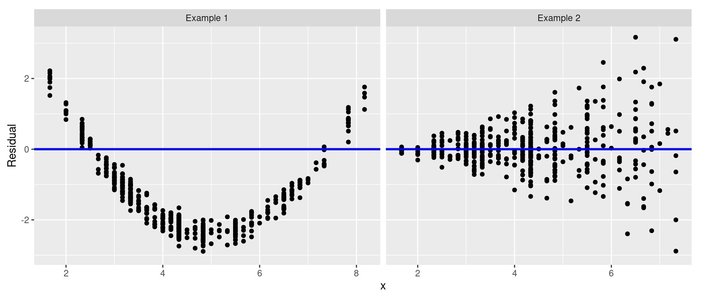

# Part 5 - Model Diagnostics

<br>


Recall once more the notation for our linear model:

For $n$ observations of $x$ and $y$ we have:

$$y_i = \beta_0 + \beta_1 x_i + \epsilon_i$$ 

$\epsilon_i \sim N(0,\sigma^2)$ and $i = 1,...,n$. 

The full probability model for $y_i$ given $x_i$ can be written as 

$$y_i|x_i \sim N(\beta_0 + \beta_1 x_i, \sigma^2)$$

## Assumptions of the Linear Model

When we fit a simple linear regression model there are five main assumptions that have to hold in order for the model to be legitimate. These assumptions are:

1. The deterministic part of the model captures all the non-random structure in the data, i.e. the residuals have mean zero.

2. The scale of the variability of the residuals is constant at all values of the explanatory variables.

3. The residuals are normally distributed.

4. The residuals are independent.

5. The values of the explanatory variables are recorded without error.

## How to check the assumptions of a Linear Model

1. Plot the residuals against the explanatory variable (e.g. `at_bats`), or plot the residuals against the fitted values ($\hat{y}$). If the first assumption holds, i.e. the residuals have mean zero, then the residuals should be scattered randomly above and below the $y=0$ line.

2. Plot the residuals against the fitted values. If the second assumption holds, i.e. the scale of the variability of the residuals is constant at all values of the explanatory variables, then the residuals should be scattered randomly across the $y=0$ line, with no fanning or any other shape, such as a parabola.  

3. Plot a histogram of the residuals, or make a QQ-plot. If the third assumption holds, i.e. the residuals are normally distributed, the histogram should appear normally distributed, in the usual bell shape and centred at zero. For the QQ-plot, the points should be as close to a straight diagonal line as possible.

4. Difficult to formally examine and often justified on the basis of experimental context.

5. Difficult to formally examine and often justified on the basis of experimental context.

<br>

### **Exercise 6**

For the linear model of runs against at-bats model, does the assumption that the deterministic part of the model captures all the non-random structure in the data, i.e. the residuals have mean zero, hold?

Run the code below to look at the scatter plot of the model residuals on the y-axis against the fitted values on the x-axis. 

```{r firstassumption, eval = FALSE, echo = TRUE}
ggplot(data = m1, aes(x = .fitted, y = .resid)) +
    geom_point() +
    geom_hline(yintercept = 0, linetype = "dashed") +
    labs(x = "Fitted Values", y = "Residuals")
```

In the above code, `geom_hline()` adds a horizontal dashed line at y equals zero.

<br>

**Does the assumption hold?**

```{r, echo = FALSE}
q_name <- sample(c(
    answer = "Yes, since the residuals are scattered evenly above and below the zero line, indicating that the residuals have mean zero.",
    "No, since the residuals are scattered evenly above and below the zero line, indicating that the residuals have mean zero.",
    "Yes, since the residuals aren't scattered evenly above and below the zero line, indicating that the residuals have non-zero mean.",
    "No, since the residuals aren't scattered evenly above and below the zero line, indicating that the residuals do not have mean zero."
)
)
```

`r longmcq(q_name)`

<br>

### **Exercise 7**

**For the runs against at-bats model, does the assumption that the scale of the variability of the residuals is constant at all values of the explanatory variables, hold?**

```{r, echo = FALSE}
q_name <- sample(c(
    "No, since the residuals are scattered randomly across the zero line, with no apparent pattern.",
    answer = "Yes, since the residuals are scattered randomly across the zero line, with no apparent pattern.",
    "No, since the residuals aren't scattered randomly across the zero line, there appears to be a slightly parabolic pattern.",
    "Yes, since the residuals aren't scattered randomly across the zero line, there appears to be a slightly parabolic pattern."
)
)
```

`r longmcq(q_name)`

<br>

See below for some further examples of the second assumption not holding. 

```{r firstnothold, echo = FALSE, out.width = "100%", fig.cap = ""}

```

<br>

**Exercise 8**

For the runs against at-bats model, does the assumption that the residuals are normally distributed, hold?

Run the code below to look at both the histogram and the normal Q-Q plot of the model residuals. 

```{r thirdassumption1, echo = TRUE, eval = FALSE}
ggplot(data = m1, aes(x = .resid)) +
    geom_histogram(color = "white", binwidth = 40) +
    xlab("Residuals")
```

```{r thirdassumption2, echo = TRUE, eval = FALSE}
ggplot(data = m1, aes(sample = .resid)) +
    stat_qq() +
    stat_qq_line()
```

<br>

**Does the assumption hold?**

```{r, echo = FALSE}
q_name <- sample(c(
    "No, since the histogram looks bell shaped and centred at zero and the points fit near-perfectly onto the line, we have shown that the residuals are normally distributed.",
    "Yes, since the histogram looks bell shaped and centred at zero and the points fit near-perfectly onto the line, we have shown that the residuals are normally distributed.",
    "No, since the histogram looks more bi-modal than bell shaped and many of the QQ-plot points are very far from the line.",
    answer = "Yes, while neither the histogram nor the QQ-plot are perfect, they both look adequate to show the residuals are approximately normally distributed. "
)
)
```

`r longmcq(q_name)`

<br>
